### 👋 This is Kaichao You, a tech lover!

I'm a researcher in AI/ML, and participate in open-source projects I use. Since 2024, I have been working on [vLLM](https://github.com/vllm-project/vllm), a high-performance and easy-to-use library for LLM inference.

I'm now starting [Inferact Inc.](https://inferact.ai/) as a co-founder and Chief Scientist. Inferact was founded by creators and core maintainers of vLLM, aiming to grow vLLM as the world's AI inference engine and accelerate AI progress by making inference cheaper and faster. Check the [blog](https://zhuanlan.zhihu.com/p/1962222805228708699) for my story and the [announcement](https://x.com/woosuk_k/status/2014383490637443380) for the company.

We are actively hiring strong candidates in AI inference, distributed systems, and machine learning. Please [submit your application](https://jobs.ashbyhq.com/inferact) or email me.

**If you want to know my research, please visit [my personal homepage](https://youkaichao.github.io/).** This page is about my open-source contributions.

### ⚡ Fun fact:

You know what? **If you are working with AI/ML, there are probably some lines of code in your computer/server that are written by me!**

### :sunglasses: Repos I made technical contributions to:

Thanks to the education in Tsinghua University, I’m equipped with full-stack abilities, ranging from low-level (assembly), backend (django) to high-level (deep learning frameworks), frontend (vue). Therefore, I occasionally participate in many open-source projects. Below is an incomplete list of my open-source contributions:

I'm a core developer for:

I'm a collaborator and constantly contribute to:

I contribute a language server protocol (LSP) to triton:

I have many other random contributions to the following famous open-source projects:

<!--
**youkaichao/youkaichao** is a ✨ _special_ ✨ repository because its `README.md` (this file) appears on your GitHub profile.

Here are some ideas to get you started:

- 🔭 I’m currently working on ...
- 🌱 I’m currently learning ...
- 👯 I’m looking to collaborate on ...
- 🤔 I’m looking for help with ...
- 💬 Ask me about ...
- 📫 How to reach me: ...
- 😄 Pronouns: ...
-  ...
-->
